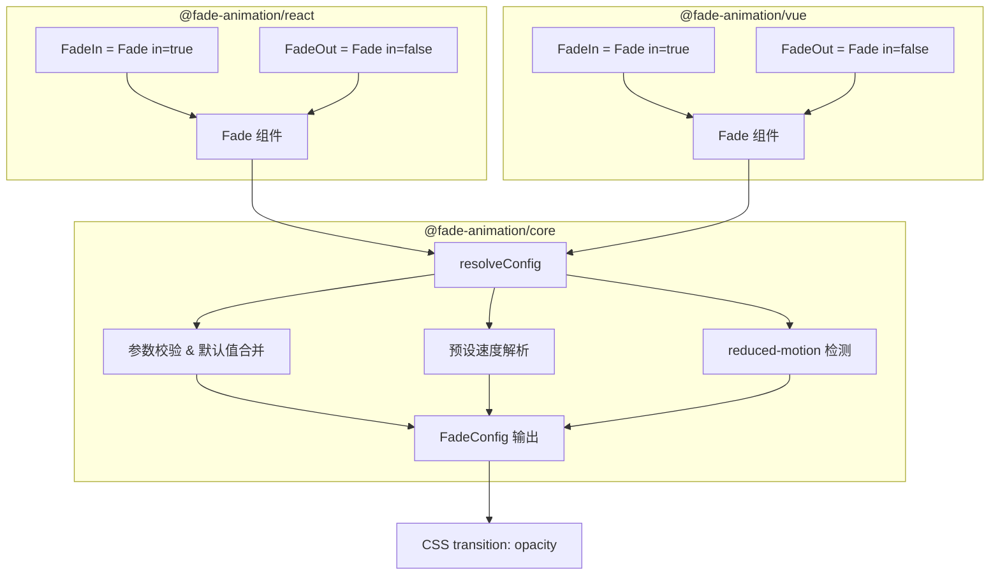
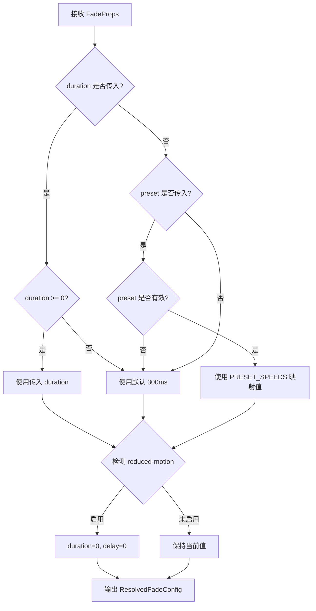

# 技术设计文档：Fade Animation Library

## 概述

Fade Animation Library 是一个轻量级、跨框架的淡入淡出动效组件库。核心设计理念是将动画逻辑与框架适配层分离：底层使用纯 CSS Transition 实现动画效果，上层分别为 React 和 Vue 提供框架原生的组件封装。

该库采用 monorepo 结构，包含三个包：
- `@fade-animation/core` — 框架无关的动画逻辑（参数校验、预设解析、reduced-motion 检测）
- `@fade-animation/react` — React 组件封装
- `@fade-animation/vue` — Vue 组件封装

核心组件为统一的 `Fade` 组件，通过 `in` 布尔属性控制淡入/淡出方向。`FadeIn` 和 `FadeOut` 作为便捷别名保留，分别等价于 `<Fade in={true}>` 和 `<Fade in={false}>`。组件支持 `className` 属性透传到根 DOM 元素，方便用户覆盖样式或集成现有设计系统。

动画实现基于 CSS `transition` 属性控制 `opacity` 变化，不依赖 JavaScript 动画帧或第三方动画库，确保性能和包体积最优。

## 架构



### 设计决策

1. **CSS Transition 而非 JS 动画**：CSS transition 由浏览器 GPU 加速，性能优于 requestAnimationFrame 方案，且实现简单。
2. **Core 层抽离**：将参数解析、校验、reduced-motion 检测等逻辑放在 core 包中，React/Vue 组件仅负责渲染和事件绑定，避免逻辑重复。
3. **Monorepo 结构**：使用 pnpm workspace 管理多包，用户按需安装对应框架包即可。
4. **CSS-in-JS inline style**：动画样式通过 inline style 注入，无需额外 CSS 文件或 CSS-in-JS 运行时，降低使用门槛。
5. **统一 Fade 组件 + 便捷别名**：核心实现为单个 `Fade` 组件，通过 `in` 属性控制方向。`FadeIn`/`FadeOut` 作为预设 `in` 值的别名保留，兼顾灵活性和易用性。
6. **className 透传**：支持 `className` 属性透传到根 DOM 元素，方便用户覆盖 inline style 或集成 Tailwind CSS、CSS Modules 等设计系统。


## 组件与接口

### Core 包 (`@fade-animation/core`)

#### `resolveConfig(options: FadeOptions): ResolvedFadeConfig`

核心配置解析函数，负责：
1. 校验输入参数（负数 duration/delay 回退默认值，无效 preset 回退 normal）
2. 解析预设速度为毫秒值
3. 检测 `prefers-reduced-motion` 媒体查询，若启用则将 duration 和 delay 置为 0
4. 当 preset 和自定义 duration 同时传入时，优先使用自定义 duration

#### `getReducedMotionPreference(): boolean`

检测当前用户是否启用了 reduced-motion 偏好。使用 `window.matchMedia('(prefers-reduced-motion: reduce)')` 实现。

#### `PRESET_SPEEDS: Record<PresetSpeed, number>`

预设速度常量映射：
```typescript
const PRESET_SPEEDS = {
  fast: 150,
  normal: 300,
  slow: 600,
} as const;
```

### React 包 (`@fade-animation/react`)

#### `<Fade in={true} {...props}>{children}</Fade>`

React 统一淡入淡出组件。通过 `in` 属性控制动画方向：
- `in={true}`（默认）：子元素从 `opacity: 0` 过渡到 `opacity: 1`（淡入）
- `in={false}`：子元素从 `opacity: 1` 过渡到 `opacity: 0`（淡出）
- 当 `in` 在运行时切换时，触发对应方向的新动画过渡

实现细节：
- 内部使用 `useEffect` 监听 `in` 属性变化触发 opacity 变化
- 监听 `transitionend` 事件触发 `onAnimationEnd` 回调
- 使用 `useRef` 确保每次过渡的回调仅触发一次
- 若传入 `className`，将其应用到根 `<div>` 元素的 `className` 属性上

#### `<FadeIn {...props}>{children}</FadeIn>`

便捷别名，等价于 `<Fade in={true} {...props}>`。

#### `<FadeOut {...props}>{children}</FadeOut>`

便捷别名，等价于 `<Fade in={false} {...props}>`。

### Vue 包 (`@fade-animation/vue`)

#### `<Fade :in="true" v-bind="props"><slot /></Fade>`

Vue 统一淡入淡出组件。通过 `in` 属性控制动画方向：
- `in={true}`（默认）：淡入效果
- `in={false}`：淡出效果
- 使用 `watch` 监听 `in` 属性变化，触发新的动画过渡

实现细节：
- 通过 `ref` 获取 DOM 元素
- 监听 `transitionend` 事件触发回调
- 使用默认插槽渲染子内容
- 若传入 `className`，将其绑定到根元素的 `class` 属性上

#### `<FadeIn v-bind="props"><slot /></FadeIn>`

便捷别名，等价于 `<Fade :in="true" v-bind="props">`。

#### `<FadeOut v-bind="props"><slot /></FadeOut>`

便捷别名，等价于 `<Fade :in="false" v-bind="props">`。


## 数据模型

### TypeScript 类型定义

```typescript
/** 预设速度类型 */
type PresetSpeed = 'fast' | 'normal' | 'slow';

/** 组件 Props 接口（React 和 Vue 共用类型定义） */
interface FadeProps {
  /** 控制动画方向：true 为淡入，false 为淡出，默认 true */
  in?: boolean;
  /** 动画持续时长（ms），默认 300ms */
  duration?: number;
  /** 动画延迟时间（ms），默认 0ms */
  delay?: number;
  /** CSS 缓动函数，默认 "ease" */
  easing?: string;
  /** 预设速度方案 */
  preset?: PresetSpeed;
  /** 动画结束回调 */
  onAnimationEnd?: () => void;
  /** 自定义 CSS 类名，透传到根 DOM 元素 */
  className?: string;
}

/** 内部解析后的配置（所有字段已确定） */
interface ResolvedFadeConfig {
  duration: number;   // 已校验，非负
  delay: number;      // 已校验，非负
  easing: string;     // 已确定
  reducedMotion: boolean; // 当前 reduced-motion 状态
}
```

### 默认值常量

```typescript
const DEFAULTS = {
  in: true,           // 默认淡入
  duration: 300,      // normal preset
  delay: 0,
  easing: 'ease',
  preset: 'normal' as PresetSpeed,
} as const;
```

### 配置解析流程




## 正确性属性（Correctness Properties）

*属性（Property）是指在系统所有有效执行中都应成立的特征或行为——本质上是对系统行为的形式化陈述。属性是人类可读规格说明与机器可验证正确性保证之间的桥梁。*

### Property 1: 自定义值覆盖默认值

*For any* 有效的非负 duration 值、非负 delay 值和任意 easing 字符串，当传入 `resolveConfig` 时，解析后的配置应分别使用这些传入值，而非默认值。

**Validates: Requirements 1.5, 1.6, 1.7, 2.5, 2.6, 2.7**

### Property 2: 自定义 Duration 优先于预设速度

*For any* 有效的预设速度（fast/normal/slow）和任意非负自定义 duration 值同时传入时，`resolveConfig` 解析后的 duration 应等于自定义 duration 值。

**Validates: Requirements 3.4**

### Property 3: 负数 Duration/Delay 回退默认值

*For any* 负数 duration 值，`resolveConfig` 应将 duration 回退为 300ms；*For any* 负数 delay 值，`resolveConfig` 应将 delay 回退为 0ms。

**Validates: Requirements 9.1, 9.2**

### Property 4: 无效预设速度回退默认值

*For any* 不属于 "fast" | "normal" | "slow" 的字符串作为 preset 传入时，`resolveConfig` 应将 duration 解析为 300ms（等同于 normal 预设）。

**Validates: Requirements 9.3**

### Property 5: Reduced-motion 下 Duration 和 Delay 归零

*For any* 输入配置（任意 duration、delay、preset 组合），当 `prefers-reduced-motion: reduce` 启用时，`resolveConfig` 解析后的 duration 和 delay 均应为 0。

**Validates: Requirements 7.1, 7.2**

### Property 6: Reduced-motion 下回调仍被调用

*For any* 启用了 reduced-motion 的动画组件实例，若传入了 `onAnimationEnd` 回调，该回调应在动画完成（即使 duration 为 0）后被调用恰好一次。

**Validates: Requirements 7.3, 6.4**

### Property 7: 回调仅触发一次

*For any* 带有 `onAnimationEnd` 回调的 FadeIn 或 FadeOut 组件实例，在一次完整的动画生命周期中，回调应被调用恰好一次。

**Validates: Requirements 6.1, 6.2, 6.4**

### Property 8: `in` 属性决定不透明度方向

*For any* Fade 组件实例，当 `in` 为 true 时，元素的初始 opacity 应为 0，目标 opacity 应为 1；当 `in` 为 false 时，初始 opacity 应为 1，目标 opacity 应为 0。

**Validates: Requirements 1.1, 2.1, 11.2, 11.3**

### Property 9: 运行时切换 `in` 属性触发新动画

*For any* 已挂载的 Fade 组件实例，当 `in` 属性从 true 变为 false（或从 false 变为 true）时，组件应触发对应方向的新 opacity 过渡动画。

**Validates: Requirements 11.4**

### Property 10: 子元素/插槽内容透传

*For any* 传入 Fade（或 FadeIn/FadeOut）组件的子元素内容，该内容应出现在组件渲染的 DOM 输出中。

**Validates: Requirements 4.4, 5.4**

### Property 11: className 透传到根元素

*For any* 传入 Fade 组件的 className 字符串，组件渲染的根 DOM 元素的 class 属性应包含该字符串。

**Validates: Requirements 10.1**

### Property 12: FadeIn/FadeOut 与 Fade 的等价性

*For any* 一组 props，`<FadeIn {...props}>` 的渲染结果应与 `<Fade in={true} {...props}>` 等价；`<FadeOut {...props}>` 的渲染结果应与 `<Fade in={false} {...props}>` 等价。

**Validates: Requirements 11.7**


## 错误处理

### 输入校验降级策略

| 场景 | 行为 |
|------|------|
| `duration` 为负数 | 静默回退到默认值 300ms |
| `delay` 为负数 | 静默回退到默认值 0ms |
| `preset` 为无效字符串 | 静默回退到 "normal"（300ms） |
| `onAnimationEnd` 为非函数值 | 忽略，不调用 |
| `easing` 为空字符串 | 使用默认值 "ease" |
| `className` 未传入或为 undefined | 根元素不附加 class 属性 |
| `in` 未传入 | 默认为 true（淡入行为） |

### 运行时错误处理

- **transitionend 事件未触发**：设置一个 `setTimeout` 作为安全网，在 `duration + delay + 50ms` 后强制触发回调，防止因浏览器兼容性问题导致回调永远不被调用。
- **组件卸载时清理**：在组件卸载时移除 `transitionend` 事件监听器和安全网定时器，防止内存泄漏。
- **SSR 环境**：`getReducedMotionPreference()` 在无 `window` 对象时返回 `false`，确保服务端渲染不报错。

## 测试策略

### 测试框架选择

- **单元测试 & 属性测试**：Vitest + fast-check
- **React 组件测试**：@testing-library/react
- **Vue 组件测试**：@vue/test-utils
- **属性测试库**：fast-check（JavaScript/TypeScript 生态中最成熟的 PBT 库）

### 属性测试（Property-Based Testing）

每个属性测试必须运行至少 100 次迭代。每个测试需通过注释引用设计文档中的属性编号。

标签格式：**Feature: fade-animation-library, Property {number}: {property_text}**

属性测试重点覆盖 `resolveConfig` 函数和组件渲染行为：

1. **Property 1 测试**：生成随机非负 duration/delay 和随机 easing 字符串，验证 resolveConfig 输出与输入一致
2. **Property 2 测试**：生成随机 preset 和随机非负 duration，验证自定义 duration 优先
3. **Property 3 测试**：生成随机负数 duration/delay，验证回退到默认值
4. **Property 4 测试**：生成不属于 fast/normal/slow 的随机字符串，验证回退到 300ms
5. **Property 5 测试**：生成任意配置组合，mock reduced-motion 为 true，验证 duration 和 delay 为 0
6. **Property 6 测试**：在 reduced-motion 模式下渲染组件，验证回调被调用恰好一次
7. **Property 7 测试**：渲染带回调的组件，模拟 transitionend 事件，验证回调调用次数为 1
8. **Property 8 测试**：生成随机 boolean 值作为 `in` 属性，渲染 Fade 组件，验证 in=true 时初始 opacity 为 0 目标为 1，in=false 时反之
9. **Property 9 测试**：渲染 Fade 组件后切换 `in` 属性值，验证 opacity 目标随之改变
10. **Property 10 测试**：生成随机子元素文本，渲染组件后验证文本出现在 DOM 中
11. **Property 11 测试**：生成随机 className 字符串，渲染 Fade 组件后验证根元素的 class 包含该字符串
12. **Property 12 测试**：生成随机 props 组合，分别渲染 FadeIn 和 `<Fade in={true}>`，验证两者 DOM 输出等价；FadeOut 同理

### 单元测试

单元测试覆盖具体示例和边界情况，与属性测试互补：

- **默认值测试**：验证无参数时 resolveConfig 返回 `{duration: 300, delay: 0, easing: 'ease'}`（Requirements 1.2-1.4, 2.2-2.4）
- **预设速度映射**：验证 fast→150, normal→300, slow→600（Requirements 3.1-3.3）
- **无回调时正常运行**：验证 onAnimationEnd 未传入时组件不报错（Requirements 6.3）
- **React 命名导出**：验证 `@fade-animation/react` 导出 Fade、FadeIn 和 FadeOut（Requirements 4.1, 4.2, 11.1）
- **Vue 命名导出**：验证 `@fade-animation/vue` 导出 Fade、FadeIn 和 FadeOut（Requirements 5.1, 5.2, 11.1）
- **Reduced-motion 运行时变化**：模拟 matchMedia 变化，验证下次动画应用新偏好（Requirements 7.4）
- **Fade 默认 in=true**：验证 Fade 组件不传 `in` 时默认执行淡入动画（Requirements 11.5）
- **className 未传入**：验证不传 className 时根元素无额外 class 属性（Requirements 10.2）
