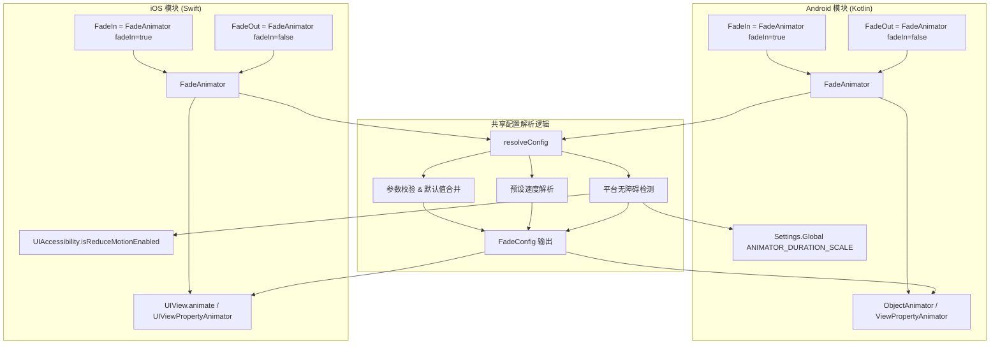
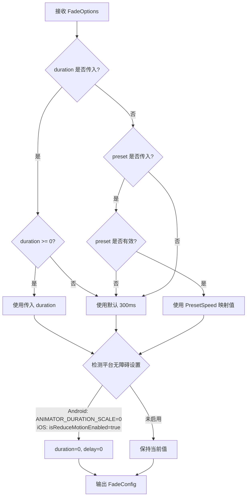

# 技术设计文档：Fade Animation Native

## 概述

Fade Animation Native 是现有 Fade Animation Library 的原生移动端扩展，为 Android (Kotlin) 和 iOS (Swift) 平台提供淡入淡出动效组件。核心设计理念与 Web 版保持一致：将动画配置解析逻辑与平台实现层分离，各平台使用原生动画 API 实现 opacity 过渡。

该库为每个平台提供独立的模块：
- **Android 模块** — 使用 Kotlin 实现，基于 `ObjectAnimator` / `ViewPropertyAnimator` 驱动 opacity 动画，使用 `TimeInterpolator` 控制缓动曲线
- **iOS 模块** — 使用 Swift 实现，基于 `UIView.animate` / `UIViewPropertyAnimator` 驱动 opacity 动画，使用 `UIView.AnimationCurve` 控制缓动曲线

两个平台共享相同的 API 设计模式：
- 统一的 `Fade` 组件，通过 `fadeIn` 布尔属性控制淡入/淡出方向
- `FadeIn` 和 `FadeOut` 作为便捷工厂方法/别名
- 预设速度方案（fast/normal/slow）
- 动画结束回调
- 平台原生的无障碍动效偏好检测
- 输入校验与降级处理

## 架构



### 设计决策

1. **原生动画 API 而非第三方库**：Android 使用 `ViewPropertyAnimator`（链式 API，简洁高效），iOS 使用 `UIView.animate`（block-based API），均由系统 GPU 加速，无需引入额外依赖。
2. **配置解析逻辑复用**：每个平台各自实现 `resolveConfig` 函数，但遵循完全相同的解析规则（与 Web 版 `@fade-animation/core` 一致），确保跨平台行为一致性。
3. **平台原生缓动曲线**：Android 默认使用 `AccelerateDecelerateInterpolator`（对应 CSS ease），iOS 默认使用 `.curveEaseInOut`。同时支持传入自定义 `TimeInterpolator` / `UIView.AnimationCurve`。
4. **生命周期感知**：Android 通过 `View.addOnAttachStateChangeListener` 监听视图移除，iOS 通过 `UIViewPropertyAnimator` 的 `stopAnimation` 方法，确保视图移除时取消动画并清理资源。
5. **统一 Fade + 便捷别名**：核心实现为 `FadeAnimator` 类，`fadeIn`/`fadeOut` 作为工厂方法或便捷函数，与 Web 版设计模式一致。

## 组件与接口

### Android 模块 (Kotlin)

#### `FadeConfig` — 配置数据类

```kotlin
data class FadeConfig(
    val duration: Long,        // 已校验，非负，单位 ms
    val delay: Long,           // 已校验，非负，单位 ms
    val interpolator: TimeInterpolator,  // 已确定
    val reducedMotion: Boolean // 当前无障碍状态
)
```

#### `resolveConfig(options: FadeOptions, context: Context): FadeConfig`

配置解析函数，职责与 Web 版 `resolveConfig` 一致：
1. 校验输入参数（负数 duration/delay 回退默认值，无效 preset 回退 normal）
2. 解析预设速度为毫秒值
3. 通过 `Settings.Global.getFloat(context.contentResolver, Settings.Global.ANIMATOR_DURATION_SCALE, 1f)` 检测 Animator duration scale，若为 0 则将 duration 和 delay 置为 0
4. 当 preset 和自定义 duration 同时传入时，优先使用自定义 duration

#### `FadeAnimator` — 核心动画控制器

```kotlin
class FadeAnimator(
    private val targetView: View,
    private val options: FadeOptions = FadeOptions()
) {
    fun start(fadeIn: Boolean = true, onEnd: (() -> Unit)? = null)
    fun cancel()
}
```

- `start(fadeIn, onEnd)`：根据 `fadeIn` 方向启动 opacity 动画，动画结束时调用 `onEnd`
- `cancel()`：取消正在进行的动画，清理资源
- 内部使用 `ViewPropertyAnimator` 实现：`targetView.animate().alpha(targetAlpha).setDuration(config.duration).setStartDelay(config.delay).setInterpolator(config.interpolator)`
- 通过 `withEndAction` 或 `AnimatorListenerAdapter.onAnimationEnd` 触发回调
- 监听 `View.OnAttachStateChangeListener.onViewDetachedFromWindow` 自动取消动画

#### 便捷扩展函数

```kotlin
fun View.fadeIn(options: FadeOptions = FadeOptions(), onEnd: (() -> Unit)? = null)
fun View.fadeOut(options: FadeOptions = FadeOptions(), onEnd: (() -> Unit)? = null)
fun View.fade(fadeIn: Boolean = true, options: FadeOptions = FadeOptions(), onEnd: (() -> Unit)? = null)
```

#### `ReducedMotionHelper` — Android 无障碍检测

```kotlin
object ReducedMotionHelper {
    fun isReducedMotionEnabled(context: Context): Boolean
}
```

通过 `Settings.Global.ANIMATOR_DURATION_SCALE` 检测，值为 0 时返回 `true`。

### iOS 模块 (Swift)

#### `FadeConfig` — 配置结构体

```swift
struct FadeConfig {
    let duration: TimeInterval    // 已校验，非负，单位秒
    let delay: TimeInterval       // 已校验，非负，单位秒
    let curve: UIView.AnimationCurve  // 已确定
    let reducedMotion: Bool       // 当前无障碍状态
}
```

> 注意：iOS 的 `UIView.animate` 使用秒为单位，内部将毫秒转换为秒。

#### `resolveConfig(options: FadeOptions) -> FadeConfig`

配置解析函数，职责与 Web 版一致。通过 `UIAccessibility.isReduceMotionEnabled` 检测 Reduce Motion 偏好。

#### `FadeAnimator` — 核心动画控制器

```swift
class FadeAnimator {
    init(targetView: UIView, options: FadeOptions = FadeOptions())
    func start(fadeIn: Bool = true, onEnd: (() -> Void)? = nil)
    func cancel()
}
```

- `start(fadeIn:onEnd:)`：根据 `fadeIn` 方向启动 opacity 动画
- `cancel()`：取消正在进行的动画
- 内部使用 `UIView.animate(withDuration:delay:options:animations:completion:)` 实现
- 通过 `completion` block 触发回调，确保仅调用一次
- 在 `deinit` 中自动取消动画并清理

#### 便捷扩展方法

```swift
extension UIView {
    func fadeIn(options: FadeOptions = FadeOptions(), onEnd: (() -> Void)? = nil)
    func fadeOut(options: FadeOptions = FadeOptions(), onEnd: (() -> Void)? = nil)
    func fade(fadeIn: Bool = true, options: FadeOptions = FadeOptions(), onEnd: (() -> Void)? = nil)
}
```

#### `ReducedMotionHelper` — iOS 无障碍检测

```swift
enum ReducedMotionHelper {
    static func isReducedMotionEnabled() -> Bool
}
```

通过 `UIAccessibility.isReduceMotionEnabled` 检测。


## 数据模型

### Android (Kotlin) 类型定义

```kotlin
/** 预设速度枚举 */
enum class PresetSpeed(val durationMs: Long) {
    FAST(150L),
    NORMAL(300L),
    SLOW(600L)
}

/** 动画配置选项（用户传入） */
data class FadeOptions(
    val fadeIn: Boolean = true,
    val duration: Long? = null,        // 单位 ms，null 表示使用默认值
    val delay: Long? = null,           // 单位 ms，null 表示使用默认值
    val interpolator: TimeInterpolator? = null,  // null 使用默认缓动
    val preset: PresetSpeed? = null,
    val onAnimationEnd: (() -> Unit)? = null
)

/** 解析后的配置（所有字段已确定） */
data class FadeConfig(
    val duration: Long,           // 已校验，非负
    val delay: Long,              // 已校验，非负
    val interpolator: TimeInterpolator,  // 已确定
    val reducedMotion: Boolean
)

/** 默认值常量 */
object Defaults {
    const val DURATION: Long = 300L
    const val DELAY: Long = 0L
    val INTERPOLATOR: TimeInterpolator = AccelerateDecelerateInterpolator()
    val PRESET: PresetSpeed = PresetSpeed.NORMAL
}
```

### iOS (Swift) 类型定义

```swift
/// 预设速度枚举
enum PresetSpeed: String {
    case fast
    case normal
    case slow

    var durationMs: Int {
        switch self {
        case .fast: return 150
        case .normal: return 300
        case .slow: return 600
        }
    }
}

/// 动画配置选项（用户传入）
struct FadeOptions {
    var fadeIn: Bool = true
    var duration: Int? = nil          // 单位 ms，nil 表示使用默认值
    var delay: Int? = nil             // 单位 ms，nil 表示使用默认值
    var curve: UIView.AnimationCurve? = nil  // nil 使用默认缓动
    var preset: PresetSpeed? = nil
    var onAnimationEnd: (() -> Void)? = nil
}

/// 解析后的配置（所有字段已确定）
struct FadeConfig {
    let duration: TimeInterval      // 已校验，非负，单位秒
    let delay: TimeInterval         // 已校验，非负，单位秒
    let curve: UIView.AnimationCurve  // 已确定
    let reducedMotion: Bool
}

/// 默认值常量
enum Defaults {
    static let duration: Int = 300
    static let delay: Int = 0
    static let curve: UIView.AnimationCurve = .easeInOut
    static let preset: PresetSpeed = .normal
}
```

### 配置解析流程




## 正确性属性（Correctness Properties）

*属性（Property）是指在系统所有有效执行中都应成立的特征或行为——本质上是对系统行为的形式化陈述。属性是人类可读规格说明与机器可验证正确性保证之间的桥梁。*

### Property 1: 自定义值覆盖默认值

*For any* 有效的非负 duration 值、非负 delay 值和任意有效 easing/interpolator，当传入 `resolveConfig` 时（且 reduced-motion 未启用），解析后的配置应分别使用这些传入值，而非默认值。

**Validates: Requirements 1.5, 1.6, 1.7, 2.5, 2.6, 2.7**

### Property 2: 自定义 Duration 优先于预设速度

*For any* 有效的预设速度（fast/normal/slow）和任意非负自定义 duration 值同时传入时（且 reduced-motion 未启用），`resolveConfig` 解析后的 duration 应等于自定义 duration 值。

**Validates: Requirements 4.4**

### Property 3: 负数 Duration/Delay 回退默认值

*For any* 负数 duration 值，`resolveConfig` 应将 duration 回退为 300ms；*For any* 负数 delay 值，`resolveConfig` 应将 delay 回退为 0ms。

**Validates: Requirements 10.1, 10.2**

### Property 4: 无效预设速度回退默认值

*For any* 不属于有效 PresetSpeed 枚举值的输入作为 preset 传入时，`resolveConfig` 应将 duration 解析为 300ms（等同于 normal 预设）。

**Validates: Requirements 10.3**

### Property 5: Reduced-motion 下 Duration 和 Delay 归零

*For any* 输入配置（任意 duration、delay、preset 组合），当平台无障碍设置指示减少动效时（Android: ANIMATOR_DURATION_SCALE=0，iOS: isReduceMotionEnabled=true），`resolveConfig` 解析后的 duration 和 delay 均应为 0。

**Validates: Requirements 6.1, 6.2, 7.1, 7.2**

### Property 6: Reduced-motion 下回调仍被调用

*For any* 启用了 reduced-motion 的动画实例，若传入了 `onAnimationEnd` 回调，该回调应在动画完成（即使 duration 为 0）后被调用恰好一次。

**Validates: Requirements 6.3, 7.3**

### Property 7: 回调仅触发一次

*For any* 带有 `onAnimationEnd` 回调的 FadeAnimator 实例，在一次完整的动画生命周期中，回调应被调用恰好一次。

**Validates: Requirements 5.1, 5.2, 5.4**

### Property 8: `fadeIn` 属性决定不透明度方向

*For any* FadeAnimator 实例，当 `fadeIn` 为 true 时，目标 opacity 应为 1（从 0 过渡到 1）；当 `fadeIn` 为 false 时，目标 opacity 应为 0（从 1 过渡到 0）。

**Validates: Requirements 1.1, 2.1, 3.2, 3.3**

### Property 9: 运行时切换 `fadeIn` 属性触发新动画

*For any* 已启动的 FadeAnimator 实例，当 `fadeIn` 参数从 true 变为 false（或从 false 变为 true）重新调用 `start` 时，应触发对应方向的新 opacity 过渡动画。

**Validates: Requirements 3.4**

### Property 10: FadeIn/FadeOut 与 Fade 的等价性

*For any* 一组 FadeOptions，通过 `fadeIn()` 扩展函数执行的动画效果应与 `fade(fadeIn: true)` 等价；通过 `fadeOut()` 执行的效果应与 `fade(fadeIn: false)` 等价。

**Validates: Requirements 3.6, 3.7**

### Property 11: 视图移除时取消动画并清理资源

*For any* 正在执行动画的 FadeAnimator 实例，当目标视图从视图层级移除时，动画应被取消且不会触发回调或导致内存泄漏。

**Validates: Requirements 8.6, 9.6**

## 错误处理

### 输入校验降级策略

| 场景 | 行为 |
|------|------|
| `duration` 为负数 | 静默回退到默认值 300ms |
| `delay` 为负数 | 静默回退到默认值 0ms |
| `preset` 为无效值 | 静默回退到 `PresetSpeed.NORMAL`（300ms） |
| `onAnimationEnd` 为 null | 忽略，不调用 |
| `interpolator`/`curve` 为 null | 使用平台默认缓动曲线 |
| `fadeIn` 未传入 | 默认为 true（淡入行为） |

### 运行时错误处理

- **Android 动画未完成回调**：使用 `AnimatorListenerAdapter.onAnimationEnd` 确保回调触发。若使用 `ViewPropertyAnimator`，通过 `withEndAction` 注册回调。设置 `Handler.postDelayed` 作为安全网，在 `duration + delay + 50ms` 后强制触发回调。
- **iOS 动画未完成回调**：`UIView.animate` 的 `completion` block 由系统保证调用（即使动画被取消，`finished` 参数为 false）。额外设置 `DispatchQueue.main.asyncAfter` 作为安全网。
- **视图移除时清理**：
  - Android：通过 `View.OnAttachStateChangeListener.onViewDetachedFromWindow` 监听，调用 `ViewPropertyAnimator.cancel()` 或 `ObjectAnimator.cancel()`
  - iOS：在 `FadeAnimator.deinit` 中调用 `UIViewPropertyAnimator.stopAnimation(true)` 或 `targetView.layer.removeAllAnimations()`
- **线程安全**：所有动画操作必须在主线程执行。Android 使用 `@MainThread` 注解标记，iOS 使用 `@MainActor` 标记。

## 测试策略

### 测试框架选择

- **Android 单元测试 & 属性测试**：JUnit 5 + jqwik（JVM 生态中成熟的 PBT 库）
- **Android 集成测试**：Robolectric（模拟 Android 环境，无需真机）
- **iOS 单元测试 & 属性测试**：XCTest + SwiftCheck（Swift 生态中的 PBT 库）
- **iOS 集成测试**：XCTest + UIKit 测试环境

### 属性测试（Property-Based Testing）

每个属性测试必须运行至少 100 次迭代。每个测试需通过注释引用设计文档中的属性编号。

标签格式：**Feature: fade-animation-native, Property {number}: {property_text}**

每个正确性属性由一个属性测试实现：

1. **Property 1 测试**：生成随机非负 duration/delay 和随机有效 interpolator/curve，验证 resolveConfig 输出与输入一致
2. **Property 2 测试**：生成随机 PresetSpeed 和随机非负 duration，验证自定义 duration 优先
3. **Property 3 测试**：生成随机负数 duration/delay，验证回退到默认值
4. **Property 4 测试**：生成无效的 preset 输入，验证回退到 300ms
5. **Property 5 测试**：生成任意配置组合，mock reduced-motion 为 true，验证 duration 和 delay 为 0
6. **Property 6 测试**：在 reduced-motion 模式下执行动画，验证回调被调用恰好一次
7. **Property 7 测试**：执行带回调的动画，验证回调调用次数为 1
8. **Property 8 测试**：生成随机 boolean 值作为 fadeIn 参数，验证 fadeIn=true 时目标 opacity 为 1，fadeIn=false 时目标 opacity 为 0
9. **Property 9 测试**：启动动画后切换 fadeIn 方向重新调用 start，验证目标 opacity 随之改变
10. **Property 10 测试**：生成随机 FadeOptions，分别通过 fadeIn() 和 fade(fadeIn: true) 执行，验证两者配置等价；fadeOut() 同理
11. **Property 11 测试**：启动动画后模拟视图移除，验证动画被取消且无回调触发

### 单元测试

单元测试覆盖具体示例和边界情况，与属性测试互补：

- **默认值测试**：验证无参数时 resolveConfig 返回 `duration=300, delay=0, easing=平台默认`（Requirements 1.2-1.4, 2.2-2.4）
- **预设速度映射**：验证 fast→150, normal→300, slow→600（Requirements 4.1-4.3）
- **无回调时正常运行**：验证 onAnimationEnd 为 null 时动画不崩溃（Requirements 5.3, 10.4）
- **null easing 回退**：验证 easing 为 null 时使用平台默认缓动（Requirements 10.5）
- **Fade 默认 fadeIn=true**：验证不传 fadeIn 时默认执行淡入动画（Requirements 3.5）
- **Reduced-motion 运行时变化**：模拟系统设置变化，验证下次动画应用新偏好（Requirements 6.4, 7.4）
- **Android 导出验证**：验证 Kotlin 模块导出 FadeAnimator、fadeIn、fadeOut、fade 扩展函数（Requirements 8.1）
- **iOS 导出验证**：验证 Swift 模块导出 FadeAnimator、fadeIn、fadeOut、fade 扩展方法（Requirements 9.1）
