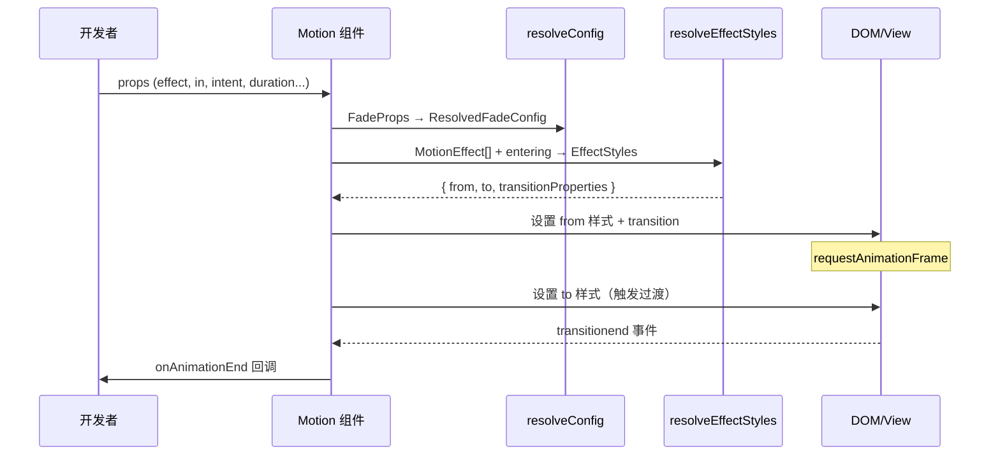
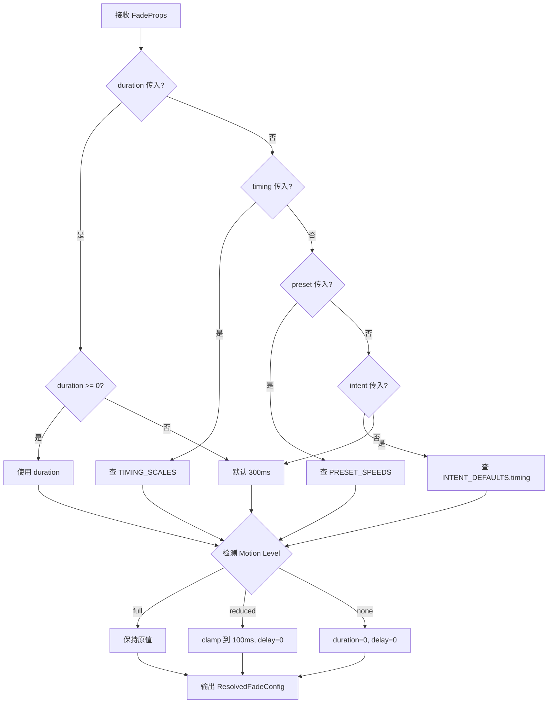

# 技术设计文档：Jiuzhou（九州）动效组件库

## 概述

Jiuzhou（九州）动效组件库是一个跨框架、跨平台的动效设计系统，基于现有 Fade Animation Library 的成熟架构进行全面升级。核心设计理念是**分层解耦**：底层 `@fade-animation/core` 提供框架无关的纯逻辑（效果系统、设计令牌、配置解析、弹簧物理、编排工具），上层分别为 React、Vue、Android（Kotlin）、iOS（Swift）提供平台原生的组件封装。

库采用 monorepo 结构，包含 5 个包：

- `packages/core` — TypeScript 核心逻辑，框架无关
- `packages/react` — React 组件封装（Motion、Fade、FadeGroup、useSpring）
- `packages/vue` — Vue 组件封装（Motion、Fade、FadeGroup、useSpring）
- `packages/android` — Kotlin 原生模块（MotionAnimator、FadeAnimator）
- `packages/ios` — Swift Package（MotionAnimator、FadeAnimator）

Web 端动画基于 CSS `transition` 驱动，由浏览器 GPU 加速；Android 使用 `ViewPropertyAnimator` + `ValueAnimator`；iOS 使用 `UIView.animate` + `CADisplayLink`。所有平台共享相同的效果类型定义、设计令牌值和配置解析逻辑，确保跨平台动效体验一致。

### 关键设计决策

1. **CSS Transition 驱动（Web）**：不依赖 JS 动画帧或第三方库，性能最优且包体积最小
2. **Core 层纯逻辑抽离**：参数解析、效果样式计算、弹簧物理等均为纯函数，便于测试和跨框架复用
3. **Effect 组合模式**：通过 Effect 数组实现任意效果组合，而非为每种组合创建独立组件
4. **Motion Intent 语义化**：开发者可通过 intent 表达动效意图，库自动推导 timing 和 easing
5. **渐进式 API**：简单场景用 `<Fade>`，复杂场景用 `<Motion effect={[...]}>` ，编排场景用 `<FadeGroup>` + `planSequence`
6. **原生平台对齐**：Android/iOS 使用各自平台最佳实践实现，但 API 语义和效果参数与 Web 端保持一致

## 架构

```mermaid
graph TD
    subgraph Core["@fade-animation/core (TypeScript)"]
        direction TB
        T[tokens.ts<br/>Motion Design Tokens] --> RC[resolveConfig.ts<br/>配置解析]
        E[effects.ts<br/>Effect 类型 & 预设] --> RES[resolveEffectStyles.ts<br/>Effect → CSS 样式]
        RC --> |ResolvedFadeConfig| OUT[配置输出]
        RES --> |EffectStyles| OUT
        SP[spring.ts<br/>弹簧物理引擎] --> OUT
        SEQ[sequence.ts<br/>序列动画] --> OUT
        STG[stagger.ts<br/>交错编排] --> OUT
        DD[dynamicDuration.ts<br/>动态时长] --> OUT
        RM[reducedMotion.ts<br/>Motion Level] --> RC
        CSS[cssTokens.ts<br/>CSS 变量输出] --> OUT
    end

    subgraph React["@fade-animation/react"]
        RM1[Motion 组件] --> RC
        RM1 --> RES
        RF[Fade 组件] --> RC
        RFG[FadeGroup 组件] --> STG
        RUS[useSpring hook] --> SP
    end

    subgraph Vue["@fade-animation/vue"]
        VM[Motion 组件] --> RC
        VM --> RES
        VF[Fade 组件] --> RC
        VFG[FadeGroup 组件] --> STG
        VUS[useSpring composable] --> SP
    end

    subgraph Android["packages/android (Kotlin)"]
        AM[MotionAnimator] --> |对齐| RC
        AF[FadeAnimator] --> AM
        AE[MotionEffect 枚举] --> |对齐| E
    end

    subgraph iOS["packages/ios (Swift)"]
        IM[MotionAnimator] --> |对齐| RC
        IF[FadeAnimator] --> IM
        IE[MotionEffect 枚举] --> |对齐| E
    end
```



### 数据流



## 组件与接口

### Core 包 (`@fade-animation/core`)

#### 效果系统

```typescript
// 7 种效果类型
type EffectType = 'fade' | 'scale' | 'slide' | 'rotate' | 'blur' | 'flip' | 'collapse';

// 效果联合类型
type MotionEffect = FadeEffect | ScaleEffect | SlideEffect | RotateEffect 
                  | BlurEffect | FlipEffect | CollapseEffect;

// 效果预设（18 种）
const EFFECT_PRESETS: Record<EffectPresetName, MotionEffect[]>;

// Effect → CSS 样式解析
function resolveEffectStyles(
  effects: MotionEffect[], entering: boolean, contentHeight?: number
): EffectStyles;
```

#### 配置解析

```typescript
// 将用户 Props 解析为最终配置
function resolveConfig(props?: FadeProps): ResolvedFadeConfig;
// 优先级：duration > timing > preset > intent > 默认值(300ms)
// easing 优先级：easing > intent > 默认值("ease")
```

#### 编排工具

```typescript
// 交错延迟计算
function stagger(count: number, options: StaggerOptions): number[];

// 序列动画规划
function planSequence(steps: SequenceStep[], defaultDuration?: number): SequencePlan;
```

#### 弹簧物理

```typescript
function createSpring(config?: SpringConfig): {
  step(dt: number): SpringState;
  reset(): void;
  current(): SpringState;
};
function estimateSpringDuration(config?: SpringConfig): number;
const SPRING_PRESETS: Record<SpringPresetName, SpringConfig>;
```

#### 辅助工具

```typescript
function dynamicDuration(options: { distance?: number; size?: number }): number;
function generateCSSTokens(prefix?: string): string;
function injectCSSTokens(prefix?: string): void;
function setMotionLevel(level: MotionLevel | undefined): void;
function resolveMotionLevel(): MotionLevel;
```

### React 包 (`@fade-animation/react`)

| 导出 | 说明 |
|------|------|
| `<Motion>` | 通用动效组件，接受 `effect`、`in`、`intent` 等属性 |
| `<Fade>` | 淡入淡出专用组件，等价于 `<Motion effect={[{type:'fade'}]}>` |
| `<FadeIn>` / `<FadeOut>` | Fade 的便捷别名 |
| `<FadeGroup>` | 多元素交错编排组件 |
| `useSpring(active, options)` | 弹簧动画 hook，返回实时进度值 |

### Vue 包 (`@fade-animation/vue`)

| 导出 | 说明 |
|------|------|
| `<Motion>` | 通用动效组件，使用 `<slot>` 渲染子内容 |
| `<Fade>` | 淡入淡出专用组件 |
| `<FadeIn>` / `<FadeOut>` | Fade 的便捷别名 |
| `<FadeGroup>` | 多元素交错编排组件 |
| `useSpring(active, options)` | 弹簧动画 composable，返回响应式 ref |

### Android 包 (`packages/android`)

| 类 | 说明 |
|----|------|
| `MotionAnimator` | 通用动效控制器，支持 7 种 Effect 组合 |
| `FadeAnimator` | 淡入淡出专用控制器（向后兼容） |
| `MotionEffect` | sealed class，定义 Fade/Scale/Slide/Rotate/Blur/Flip/Collapse |
| `EffectPresets` | 预设效果组合 |
| `View.fadeIn()` / `View.fadeOut()` | 扩展函数 |

### iOS 包 (`packages/ios`)

| 类 | 说明 |
|----|------|
| `MotionAnimator` | 通用动效控制器，支持 7 种 Effect 组合 |
| `FadeAnimator` | 淡入淡出专用控制器（向后兼容） |
| `MotionEffect` | enum，定义 fade/scale/slide/rotate/blur/flip/collapse |
| `EffectPresets` | 预设效果组合 |
| `UIView.fadeIn()` / `UIView.fadeOut()` | 扩展方法 |


## 数据模型

### TypeScript 类型定义（Core）

```typescript
// === Effect 类型 ===
interface FadeEffect   { type: 'fade';   from?: number; to?: number; }
interface ScaleEffect  { type: 'scale';  from?: number; to?: number; }
interface SlideEffect  { type: 'slide';  direction?: 'up'|'down'|'left'|'right'; distance?: number; }
interface RotateEffect { type: 'rotate'; from?: number; to?: number; }
interface BlurEffect   { type: 'blur';   from?: number; to?: number; }
interface FlipEffect   { 
  type: 'flip'; axis?: 'x'|'y'; from?: number; to?: number;
  perspective?: number; backfaceVisibility?: 'visible'|'hidden'; flipped?: boolean;
}
interface CollapseEffect { type: 'collapse'; collapsedHeight?: number; }

type MotionEffect = FadeEffect | ScaleEffect | SlideEffect | RotateEffect 
                  | BlurEffect | FlipEffect | CollapseEffect;

// === 预设名称 ===
type EffectPresetName = 'fade-in' | 'fade-out' | 'scale-fade-in' | 'scale-fade-out'
  | 'slide-up-in' | 'slide-down-out' | 'slide-left-in' | 'slide-right-in'
  | 'rotate-fade-in' | 'rotate-fade-out' | 'blur-fade-in' | 'blur-fade-out'
  | 'flip-x-in' | 'flip-x-out' | 'flip-y-in' | 'flip-y-out'
  | 'collapse-in' | 'collapse-out';

// === Motion Design Tokens ===
type TimingScale = 't1' | 't2' | 't3' | 't4' | 't5';
type TimingAlias = 'extra-fast' | 'fast' | 'normal' | 'slow' | 'extra-slow';
type DistanceScale = 'd1' | 'd2' | 'd3' | 'd4' | 'd5';
type DistanceAlias = 'micro' | 'small' | 'medium' | 'large' | 'full';
type EasingName = 'productive' | 'expressive' | 'enter' | 'exit' | 'linear';
type MotionIntent = 'enter' | 'exit' | 'focus' | 'feedback' | 'delight';

// === 配置 Props ===
interface FadeProps {
  in?: boolean;
  duration?: number;
  delay?: number;
  easing?: string;
  preset?: PresetSpeed;
  timing?: TimingScale | TimingAlias;
  intent?: MotionIntent;
  onAnimationEnd?: () => void;
  className?: string;
}

interface ResolvedFadeConfig {
  duration: number;
  delay: number;
  easing: string;
  reducedMotion: boolean;
}

// === 弹簧配置 ===
interface SpringConfig {
  stiffness?: number;  // 默认 100
  damping?: number;    // 默认 10
  mass?: number;       // 默认 1
  velocity?: number;   // 默认 0
  restThreshold?: number; // 默认 0.001
}
type SpringPresetName = 'gentle' | 'snappy' | 'bouncy' | 'slow' | 'noWobble';

// === 编排 ===
interface StaggerOptions {
  interval: number;
  baseDelay?: number;
  direction?: 'forward' | 'reverse' | 'center';
}

interface SequenceStep {
  effects: MotionEffect[];
  duration?: number;
  delay?: number;
}

interface SequencePlan {
  stepDelays: number[];
  stepDurations: number[];
  totalDuration: number;
}

// === Motion Level ===
type MotionLevel = 'full' | 'reduced' | 'none';

// === Effect 样式输出 ===
interface EffectStyles {
  from: Record<string, string>;
  to: Record<string, string>;
  transitionProperties: string[];
}
```

### 设计令牌常量值

| 令牌类型 | 键 | 值 | 语义别名 |
|---------|----|----|---------|
| Timing | t1 | 100ms | extra-fast |
| Timing | t2 | 150ms | fast |
| Timing | t3 | 300ms | normal |
| Timing | t4 | 500ms | slow |
| Timing | t5 | 700ms | extra-slow |
| Distance | d1 | 4px | micro |
| Distance | d2 | 8px | small |
| Distance | d3 | 16px | medium |
| Distance | d4 | 32px | large |
| Distance | d5 | 64px | full |
| Easing | productive | cubic-bezier(0.2, 0, 0.38, 0.9) | — |
| Easing | expressive | cubic-bezier(0.4, 0.14, 0.3, 1) | — |
| Easing | enter | cubic-bezier(0, 0, 0.3, 1) | — |
| Easing | exit | cubic-bezier(0.4, 0, 1, 1) | — |
| Easing | linear | linear | — |

### Intent 默认映射

| Intent | Timing | Easing |
|--------|--------|--------|
| enter | t3 (300ms) | enter |
| exit | t2 (150ms) | exit |
| focus | t2 (150ms) | expressive |
| feedback | t1 (100ms) | productive |
| delight | t4 (500ms) | expressive |

### 配置解析优先级流程




## 正确性属性（Correctness Properties）

*属性（Property）是指在系统所有有效执行中都应成立的特征或行为——本质上是对系统行为的形式化陈述。属性是人类可读规格说明与机器可验证正确性保证之间的桥梁。*

### Property 1: Effect 组合产生有效 CSS 样式

*For any* 有效的 MotionEffect 数组（不含 flip+rotate 冲突），`resolveEffectStyles` 应返回包含所有指定效果对应 CSS 属性的 `from`/`to` 样式对象，且 `transitionProperties` 列表应包含所有需要过渡的属性名。

**Validates: Requirements 1.3, 18.4**

### Property 2: Flip+Rotate 冲突解决

*For any* 同时包含 FlipEffect 和 RotateEffect 的 MotionEffect 数组，`resolveEffectStyles` 应忽略 RotateEffect，输出中不应包含独立的 rotate transform（仅保留 flip 的 perspective+rotateX/Y）。

**Validates: Requirements 1.4**

### Property 3: 预设名称解析为效果数组

*For any* 有效的 EffectPresetName 字符串，在 EFFECT_PRESETS 中查找应返回一个非空的 MotionEffect 数组。

**Validates: Requirements 1.6**

### Property 4: 配置解析优先级

*For any* 同时传入 duration、timing、preset、intent 的 FadeProps，`resolveConfig` 解析的 duration 应等于直接传入的 duration 值（最高优先级）。*For any* 同时传入 easing 和 intent 的 FadeProps，解析的 easing 应等于直接传入的 easing 值。

**Validates: Requirements 3.5, 3.6, 4.4, 10.1, 10.2, 18.1**

### Property 5: 负数输入回退默认值

*For any* 负数 duration 值，`resolveConfig` 应返回 duration=300ms；*For any* 负数 delay 值，`resolveConfig` 应返回 delay=0ms。

**Validates: Requirements 10.3, 10.4, 18.2, 18.3**

### Property 6: 动画回调恰好触发一次

*For any* 带有 `onAnimationEnd` 回调的 Motion/Fade 组件实例，在一次完整的动画生命周期中（无论 reducedMotion 是否启用），回调应被调用恰好一次。

**Validates: Requirements 3.7, 4.6, 12.6**

### Property 7: className 和子元素透传

*For any* 传入 Motion/Fade 组件的 className 字符串，根 DOM 元素的 class 应包含该字符串。*For any* 传入的子元素内容，该内容应出现在组件渲染的 DOM 输出中。

**Validates: Requirements 3.8, 13.5, 14.5**

### Property 8: FadeIn/FadeOut 与 Fade 的等价性

*For any* 一组 props，`<FadeIn {...props}>` 的渲染结果应与 `<Fade in={true} {...props}>` 等价；`<FadeOut {...props}>` 的渲染结果应与 `<Fade in={false} {...props}>` 等价。

**Validates: Requirements 4.5**

### Property 9: Stagger 延迟计算

*For any* 正整数 count 和非负 interval：
- direction="forward" 时，返回 `[0, interval, 2*interval, ..., (count-1)*interval]`
- direction="reverse" 时，返回 forward 结果的逆序
- direction="center" 时，中间元素延迟最小，两端延迟最大，且对称

**Validates: Requirements 5.2, 5.3, 5.4, 8.2, 8.3, 8.4**

### Property 10: 弹簧收敛性

*For any* 有效的 SpringConfig（stiffness > 0, damping > 0, mass > 0），经过足够多的 step 调用后，弹簧应收敛到目标位置 1，且 atRest 应为 true。

**Validates: Requirements 6.1, 6.3**

### Property 11: 弹簧重置 Round-Trip

*For any* 已经执行过若干 step 的 Spring 实例，调用 reset 后，position 应回到 0，velocity 应回到初始值。

**Validates: Requirements 6.4**

### Property 12: 序列动画规划不变量

*For any* 有效的 SequenceStep 数组，`planSequence` 返回的 totalDuration 应等于所有 stepDurations 和 stepDelays 中间隙的总和。stepDelays 应单调非递减。未指定 duration 的步骤应使用默认值 300ms。

**Validates: Requirements 7.1, 7.2, 7.3, 7.4, 7.5**

### Property 13: 动态时长边界与单调性

*For any* 正数 size 或 distance，`dynamicDuration` 返回值应在 [100, 700] 范围内。*For any* 两个 size 值 s1 < s2，`dynamicDuration({size: s1})` ≤ `dynamicDuration({size: s2})`（单调非递减）。distance 同理。

**Validates: Requirements 9.1, 9.2, 9.3, 9.4**

### Property 14: CSS Token 完整性

*For any* 前缀字符串 prefix，`generateCSSTokens(prefix)` 返回的 CSS 字符串应包含所有 5 个 Timing_Scale 变量、所有 5 个 Distance_Scale 变量和所有 5 个 Easing_Curve 变量。

**Validates: Requirements 11.1, 11.3**

### Property 15: Motion Level 设置/获取 Round-Trip

*For any* MotionLevel 值（'full'、'reduced'、'none'），调用 `setMotionLevel(level)` 后，`getMotionLevel()` 应返回相同的值。调用 `setMotionLevel(undefined)` 后，`getMotionLevel()` 应返回 undefined。

**Validates: Requirements 12.2**

### Property 16: Motion Level 时长控制

*For any* 输入配置：当 motionLevel='reduced' 时，resolveConfig 的 duration 应 ≤ 100ms 且 delay=0；当 motionLevel='none' 时，duration=0 且 delay=0。

**Validates: Requirements 12.3, 12.4**

### Property 17: Effect 样式 Round-Trip

*For any* 包含 fade 和/或 scale 效果的 MotionEffect 数组（带有显式 from/to 值），`resolveEffectStyles` 产生的 CSS from/to 样式中的数值应与原始 Effect 参数中的 from/to 值一致。

**Validates: Requirements 18.5**


## 错误处理

### 输入校验降级策略

| 场景 | 行为 |
|------|------|
| `duration` 为负数 | 静默回退到默认值 300ms |
| `delay` 为负数 | 静默回退到默认值 0ms |
| `preset` 为无效字符串 | 静默回退到 "normal"（300ms） |
| `timing` 为无效字符串 | 静默回退到默认值 300ms |
| `intent` 为无效字符串 | 忽略 intent，使用其他来源或默认值 |
| `easing` 为空字符串 | 使用默认值 "ease" |
| `effect` 为空数组 | 不应用任何效果，组件正常渲染子内容 |
| `effect` 为无效预设名 | 运行时错误（TypeScript 编译时已约束） |
| `onAnimationEnd` 为非函数值 | 忽略，不调用 |
| `className` 未传入 | 根元素不附加 class 属性 |
| `in` 未传入 | 默认为 true（进入动画） |
| Flip + Rotate 同时存在 | 忽略 Rotate，输出 console.warn 警告 |
| `stagger` count ≤ 0 | 返回空数组 |
| `stagger` interval 为负数 | 视为 0 |
| Spring stiffness/damping/mass ≤ 0 | 使用默认值 |

### 运行时错误处理

- **transitionend 未触发（Web）**：设置 `setTimeout` 安全网，在 `duration + delay + 50ms` 后强制触发回调
- **组件卸载时清理（Web）**：移除 transitionend 监听器、取消 rAF、清除安全网定时器
- **View detach 时清理（Android）**：通过 OnAttachStateChangeListener 自动取消动画
- **deinit 时清理（iOS）**：在 deinit 中调用 cancelInternal，移除所有动画和定时器
- **SSR 环境（Web）**：`getReducedMotionPreference()` 在无 window 时返回 false；`injectCSSTokens()` 在无 document 时静默跳过
- **ResizeObserver 不可用**：Collapse 效果在不支持 ResizeObserver 的环境中使用初始测量值

### 平台特定处理

| 平台 | Reduced Motion 检测 | Blur 效果 | Flip 实现 |
|------|---------------------|-----------|-----------|
| Web | `prefers-reduced-motion` 媒体查询 | CSS `filter: blur()` | CSS `perspective()` + `rotateX/Y()` |
| Android | `Settings.Global.ANIMATOR_DURATION_SCALE` | `RenderEffect` (API 31+)，低版本静默跳过 | `Camera` + `Matrix` via `cameraDistance` + `rotationX/Y` |
| iOS | `UIAccessibility.isReduceMotionEnabled` | `UIVisualEffectView` 或 Core Image | `CATransform3D` via `CADisplayLink` |

## 测试策略

### 测试框架选择

| 平台 | 单元测试 | 属性测试 | 组件测试 |
|------|---------|---------|---------|
| Core (TS) | Vitest | fast-check | — |
| React | Vitest | fast-check | @testing-library/react |
| Vue | Vitest | fast-check | @vue/test-utils |
| Android | JUnit 5 | — | — |
| iOS | XCTest | — | — |

### 属性测试（Property-Based Testing）

属性测试库：**fast-check**（JavaScript/TypeScript 生态中最成熟的 PBT 库）

配置要求：
- 每个属性测试最少运行 **100 次迭代**
- 每个测试通过注释引用设计文档中的属性编号
- 标签格式：**Feature: jiuzhou-animation-library, Property {number}: {property_text}**

属性测试覆盖范围（对应 17 个 Correctness Properties）：

1. **Property 1**：生成随机 MotionEffect 组合，验证 resolveEffectStyles 输出包含所有效果的 CSS 属性
2. **Property 2**：生成包含 flip+rotate 的随机效果数组，验证输出不含独立 rotate
3. **Property 3**：遍历所有 EffectPresetName，验证 EFFECT_PRESETS 查找返回非空数组
4. **Property 4**：生成随机 duration+timing+preset+intent 组合，验证 duration 优先级；生成随机 easing+intent，验证 easing 优先级
5. **Property 5**：生成随机负数 duration/delay，验证回退到默认值
6. **Property 6**：渲染带回调的组件，模拟动画完成，验证回调调用次数为 1
7. **Property 7**：生成随机 className 和子元素文本，渲染后验证 DOM 包含两者
8. **Property 8**：生成随机 props，分别渲染 FadeIn 和 Fade in=true，验证等价
9. **Property 9**：生成随机 count/interval，验证三种 direction 的延迟数组正确性
10. **Property 10**：生成随机 SpringConfig，验证弹簧收敛到 1
11. **Property 11**：步进弹簧后 reset，验证 position 回到 0
12. **Property 12**：生成随机 SequenceStep 数组，验证 totalDuration 不变量
13. **Property 13**：生成随机 size/distance，验证 dynamicDuration 在 [100,700] 且单调
14. **Property 14**：生成随机 prefix，验证 CSS 输出包含所有 token 变量
15. **Property 15**：设置随机 MotionLevel，验证 get 返回相同值
16. **Property 16**：设置 reduced/none，生成随机配置，验证 duration 约束
17. **Property 17**：生成带显式 from/to 的 fade/scale 效果，验证 CSS 值与原始参数一致

### 单元测试

单元测试覆盖具体示例和边界情况，与属性测试互补：

- **默认值**：无参数时 resolveConfig 返回 `{duration: 300, delay: 0, easing: 'ease'}`
- **预设速度映射**：fast→150, normal→300, slow→600
- **Timing Scale 映射**：t1→100, t2→150, t3→300, t4→500, t5→700
- **Intent 默认值**：enter→{t3, enter}, exit→{t2, exit} 等
- **Effect 预设数量**：EFFECT_PRESETS 至少 18 个
- **Spring 预设数量**：SPRING_PRESETS 有 5 个
- **Collapse 效果**：展开/折叠的 max-height 计算
- **Flip backfaceVisibility**：hidden 时背面不可见
- **React/Vue 命名导出**：验证所有组件和 hook 正确导出
- **Android/iOS 效果类型**：验证 MotionEffect 包含所有 7 种类型
- **SSR 安全**：getReducedMotionPreference 在无 window 时返回 false
- **空 stagger**：count=0 返回空数组
- **单元素 stagger**：count=1 返回 [baseDelay]

