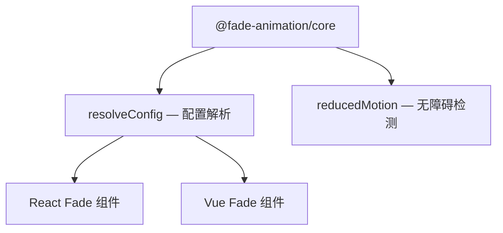

# 用 Kiro Spec 建立动效组件库：全流程教学

## 什么是 Kiro Spec？

Kiro Spec 是 Kiro IDE 内置的一套结构化开发流程。它把"想做什么"到"怎么做"拆成三个文件：

```
.kiro/specs/<你的功能名>/
├── requirements.md   ← 需求：我要什么？
├── design.md         ← 设计：怎么实现？
└── tasks.md          ← 任务：一步步做
```

你只需要用自然语言描述需求，Kiro 会帮你逐步生成设计方案和实现任务，然后一个个执行。

---

## 全流程概览

```
第 1 步：创建 Spec → 第 2 步：写需求 → 第 3 步：生成设计 → 第 4 步：生成任务 → 第 5 步：执行任务
```

下面以"建立一个淡入淡出动效组件库"为例，走一遍完整流程。

---

## 第 1 步：创建 Spec

在 Kiro 左侧面板找到 **Specs** 区域，点击 **+** 按钮，输入功能名称：

```
fade-animation-library
```

Kiro 会自动创建目录结构：

```
.kiro/specs/fade-animation-library/
├── requirements.md
├── design.md
└── tasks.md
```

---

## 第 2 步：编写需求（requirements.md）

这是最关键的一步。你需要告诉 Kiro **你想要什么**，而不是怎么做。

### 基本结构

```markdown
# 需求文档

## 简介
一两句话说清楚这个库是干什么的。

## 术语表
定义关键术语，避免歧义。

## 需求
### 需求 1：xxx
### 需求 2：xxx
...
```

### 写需求的技巧

每个需求包含三部分：

1. **标题** — 简短描述功能点
2. **用户故事** — "作为 xxx，我希望 xxx"
3. **验收标准** — 用 WHEN/SHALL/IF/THEN 格式写清楚行为

### 实际例子

```markdown
### 需求 1：FadeIn 淡入动画组件

**用户故事：** 作为前端开发者，我希望使用 FadeIn 组件包裹子元素，
使其以淡入效果出现在页面上。

#### 验收标准

1. WHEN FadeIn 组件挂载到 DOM 时，SHALL 将子元素的不透明度从 0 过渡到 1
2. SHALL 默认使用 300ms 作为动画时长
3. SHALL 默认使用 0ms 作为延迟
4. SHALL 默认使用 "ease" 作为缓动函数
5. WHEN duration 属性被传入时，SHALL 使用传入值覆盖默认值
```

### 需求拆分建议

对于动效组件库，建议按以下维度拆分需求：

| 维度 | 示例需求 |
|------|----------|
| 核心动画 | FadeIn 组件、FadeOut 组件 |
| 配置能力 | 预设速度（fast/normal/slow） |
| 框架适配 | React 支持、Vue 支持 |
| 回调机制 | 动画结束回调 |
| 无障碍 | prefers-reduced-motion 支持 |
| 类型安全 | TypeScript 类型定义 |
| 容错 | 输入校验与降级 |

> 💡 **小贴士**：不用一次写完所有需求。先写核心功能，后续可以创建新的 Spec 来扩展。
> 比如先做 `fade-animation-library`（Web 端），再做 `fade-animation-native`（iOS/Android）。

---

## 第 3 步：生成设计（design.md）

需求写好后，点击 design.md 旁边的 ▶ 按钮，Kiro 会根据需求自动生成技术设计文档。

### 设计文档包含什么

```markdown
# 技术设计文档

## 概述          ← 技术方案总结
## 架构          ← 模块划分、数据流图（Mermaid）
## 组件与接口     ← 具体的类/函数签名
## 数据模型       ← 类型定义、默认值表
## 正确性属性     ← 用于属性测试的形式化描述
## 错误处理       ← 异常场景和降级策略
## 测试策略       ← 测试框架选择、测试清单
```

### 实际例子：架构图

Kiro 会生成 Mermaid 图来描述模块关系：



### 实际例子：接口定义

```typescript
// Kiro 会根据需求自动设计出接口
export function resolveConfig(options: FadeOptions): ResolvedFadeConfig;

export interface FadeOptions {
  in?: boolean;
  duration?: number;
  delay?: number;
  easing?: string;
  preset?: 'fast' | 'normal' | 'slow';
  onAnimationEnd?: () => void;
  className?: string;
}
```

### 实际例子：正确性属性

这是 Kiro Spec 的一个亮点——它会自动提炼出可测试的"属性"：

```markdown
### Property 1: 自定义值覆盖默认值

*For any* 有效的非负 duration 和 delay，当传入 resolveConfig 时，
解析后的配置应使用传入值，而非默认值。

**验证：需求 1.5, 1.6, 1.7**
```

> 💡 **小贴士**：设计文档生成后，仔细审阅。如果架构不合理，可以直接修改或让 Kiro 重新生成。

---

## 第 4 步：生成任务（tasks.md）

点击 tasks.md 旁边的 ▶ 按钮，Kiro 会把设计方案拆解成可执行的任务列表。

### 任务文档的结构

```markdown
# 实现计划

## 概述
实现顺序和整体策略。

## Tasks
- [ ] 1. 第一个大任务
  - [ ] 1.1 子任务 A
  - [ ] 1.2 子任务 B
  - [ ]* 1.3 可选子任务（测试）
- [ ] 2. 第二个大任务
  ...
- [ ] N. 检查点 — 确保测试通过
```

### 任务的特点

1. **有序递增** — 按依赖关系排列，先基础后上层
2. **可追溯** — 每个任务标注了对应的需求编号
3. **有检查点** — 阶段性验证，确保不会跑偏
4. **可选标记** — `*` 标记的任务可跳过，加速 MVP

### 实际例子：动效库的任务顺序

```
1. 搭建 monorepo 项目结构和核心类型定义
2. 实现 core 包的配置解析逻辑（resolveConfig）
3. 检查点 — 确保 core 包测试通过
4. 实现 React 组件（Fade、FadeIn、FadeOut）
5. 检查点 — 确保 React 包测试通过
6. 实现 Vue 组件
7. 最终检查点 — 全量测试通过
```

### 实际例子：单个任务的详细描述

```markdown
- [ ] 4.1 实现 React Fade 组件
  - 在 `packages/react/src/Fade.tsx` 中实现统一 Fade 组件
  - 使用 `useEffect` 监听 `in` 属性变化触发 opacity 过渡
  - 通过 inline style 设置 CSS transition 属性
  - 监听 `transitionend` 事件触发 `onAnimationEnd` 回调
  - 使用 `useRef` 确保回调仅触发一次
  - 设置安全网 setTimeout 防止 transitionend 未触发
  - 支持 `className` 透传到根 `<div>` 元素
  - _Requirements: 1.1, 2.1, 4.4, 6.1, 6.2, 6.3, 6.4, 7.3_
```

---

## 第 5 步：执行任务

点击任务旁边的 ▶ 按钮，Kiro 会自动开始编码实现。

### 执行过程

1. Kiro 读取任务描述和关联的需求/设计
2. 自动创建文件、编写代码
3. 任务完成后标记为 `[x]`
4. 遇到检查点时会运行测试并确认

### 你需要做的

- **审阅代码** — Kiro 写完后检查是否符合预期
- **回答问题** — 遇到不确定的地方 Kiro 会问你
- **调整方向** — 如果实现不对，可以修改任务描述后重新执行

---

## 进阶：迭代扩展

一个 Spec 做完后，可以创建新的 Spec 来扩展功能。

### 真实的迭代路径

```
Spec 1: fade-animation-library
  → 核心淡入淡出 + React/Vue 支持

Spec 2: fade-animation-native
  → 扩展到 iOS (Swift) + Android (Kotlin)

Spec 3: flip-collapse-effects
  → 新增 3D 翻转 + 折叠展开效果
```

每个新 Spec 的需求文档可以引用已有代码：

```markdown
## 简介
在现有 Fade Animation Library 的 effects 体系（已支持 fade、scale、slide、rotate、blur）
基础上，新增 Flip（3D 翻转）和 Collapse（折叠展开）两种动效类型。
```

---

## 常见问题

### Q：需求要写多细？

验收标准越具体，Kiro 生成的代码越准确。用 WHEN/SHALL/IF/THEN 格式写，避免模糊描述。

❌ "动画要流畅"
✅ "SHALL 默认使用 300ms 作为 Duration"

### Q：可以只写需求，跳过设计直接生成任务吗？

可以，但不建议。设计文档帮你理清架构，避免后期大改。

### Q：任务执行到一半发现需求有问题怎么办？

直接修改 requirements.md，然后重新生成 design.md 和 tasks.md。已完成的任务不会被影响。

### Q：Spec 之间可以互相引用吗？

可以。在 Spec 文件中使用 `#[[file:相对路径]]` 语法引用其他文件：

```markdown
参考现有的核心类型定义：#[[file:packages/core/src/effects.ts]]
```

### Q：一个 Spec 应该多大？

建议一个 Spec 对应一个可独立交付的功能模块。太大会导致任务过多难以管理，太小则失去结构化的意义。

---

## 总结

```
1. 创建 Spec（起个好名字）
2. 写需求（用户故事 + 验收标准）
3. 生成设计（审阅架构和接口）
4. 生成任务（检查顺序和依赖）
5. 逐个执行（审阅 + 反馈）
6. 迭代扩展（新 Spec 继续）
```

核心理念：**你负责定义"要什么"，Kiro 负责规划"怎么做"并执行。**
